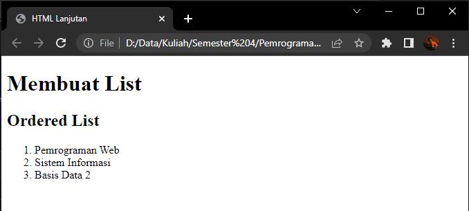
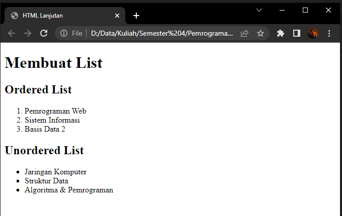
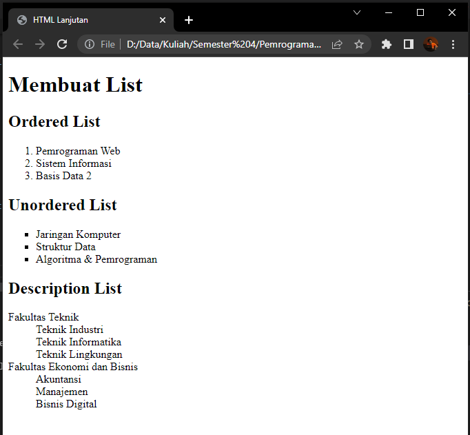
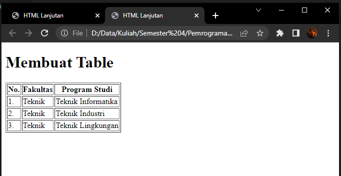
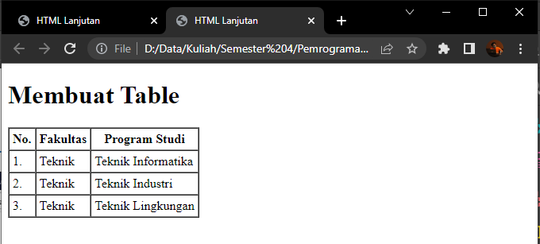
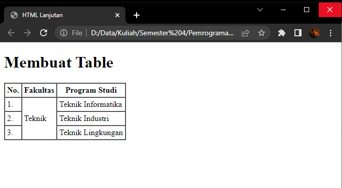
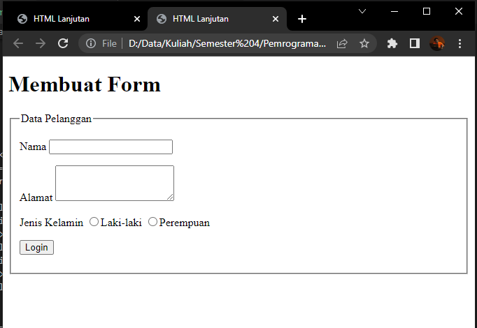
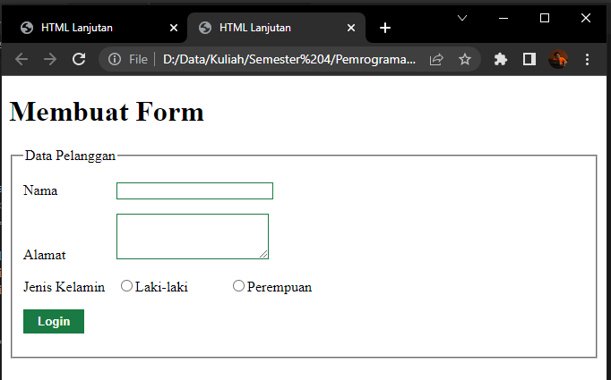

# Lab3Web

## Tugas Praktikum 3

Nama    : Faza Ardan Kusuma <br>
NIM     : 312010001<br>
Kelas   : TI 20 B1

<hr>

Pertama - tama, buat file html dengan nama file <b>lab3_list.html</b> dengan syntax berikut :<br>
```
<!DOCTYPE html> 
<html lang="en"> 
    <head> 
        <meta charset="UTF-8"> 
        <meta name="viewport" content="width=device-width, initial-scale=1.0"> 
        <title>HTML Lanjutan</title> 
    </head> 
    <body> 
        <header> <h1>Membuat List</h1> 
        </header> 
    </body> 
    </html>
```

## 1. Ordered List

Lalu tambahkan syntax berikut dibawahnya untuk membuat <i>Ordered List</i><br>

```
    <section id="order-list"> 
        <h2>Ordered List</h2> 
        <ol>
            <li>Pemrograman Web</li> 
            <li>Sistem Informasi</li> 
            <li>Basis Data 2</li> 
        </ol> 
    </section>
```

Berikut adalah outputnya.<br>
<br>

## 2. Unordered List

Untuk membuat <i>Unordered List</i>, kita tambahkan syntax berikut : <br>
```
    <section id="unorder-list"> 
        <h2>Unordered List</h2> 
        <ul type="square"> 
            <li>Jaringan Komputer</li> 
            <li>Struktur Data</li> 
            <li>Algoritma &amp; Pemrograman</li> 
        </ul> 
    </section>
```

Berikut outputnya : <br>
<br>

## 3. Description List

Setelah <i>Unordered List</i>, mari kita tambahkan <i>Description List</i> dengan menambahkan syntax berikut : <br>
```
    <section id="unorder-list"> 
        <h2>Description List</h2> 
        <dl> 
            <dt>Fakultas Teknik</dt> 
            <dd>Teknik Industri</dd> 
            <dd>Teknik Informatika</dd> 
            <dd>Teknik Lingkungan</dd> 
            <dt>Fakultas Ekonomi dan Bisnis</dt> 
            <dd>Akuntansi</dd> 
            <dd>Manajemen</dd> 
            <dd>Bisnis Digital</dd> 
        </dl> 
        </section>
```

Maka, tampilan keseluruhannya menjadi seperti berikut :<br>
<br>

## 4. Membuat Tabel

Kemudian kita akan membuat tabel, tapi disini kita akan membuat file baru dengan nama file <b>lab3_tabel.html</b> dengan syntax berikut :<br>
```
<!DOCTYPE html> 
<html lang="en"> 
    <head> 
        <meta charset="UTF-8"> 
        <meta name="viewport" content="width=device-width, initial-scale=1.0"> 
    <title>HTML Lanjutan</title> 
</head> 
<body> 
    <header> 
        <h1>Membuat Table</h1> 
    </header> 
</body> 
</html>
```

Lalu kita tambahkan syntax tabel sederhana : <br>
```
<table border="1"> 
    <thead> 
        <tr> 
            <th>No.</th> 
            <th>Fakultas</th> 
            <th>Program Studi</th> 
        </tr> 
    </thead> 
    <tbody> 
        <tr> 
            <td>1.</td> 
            <td>Teknik</td> 
            <td>Teknik Informatika</td> 
        </tr> 
        <tr> 
            <td>2.</td> 
            <td>Teknik</td> 
            <td>Teknik Industri</td> 
        </tr> 
        <tr> 
            <td>3.</td> 
            <td>Teknik</td> 
            <td>Teknik Lingkungan</td> 
        </tr> 
    </tbody> 
</table>
```

Berikut tampilan tabelnya :<br>
<br>

## 5. Mengatur Margin dan Padding

Disini tabel akan saya modifikasi dengan mengatur <i>margin dan padding</i> dengan menambahkan atribut <b>cellpadding</b> dan <b> cellspacing</b> pada tag table. Maka syntaxnya menjadi :<br>
```
<!DOCTYPE html> 
<html lang="en"> 
    <head> 
        <meta charset="UTF-8"> 
        <meta name="viewport" content="width=device-width, initial-scale=1.0"> 
    <title>HTML Lanjutan</title> 
</head> 
<body> 
    <header> 
        <h1>Membuat Table</h1> 
    </header> 
</body> 
</html>

<table border="1" cellpadding="4" cellspacing="0"> 
    <thead> 
        <tr> 
            <th>No.</th> 
            <th>Fakultas</th> 
            <th>Program Studi</th> 
        </tr> 
    </thead> 
    <tbody> 
        <tr> 
            <td>1.</td> 
            <td>Teknik</td> 
            <td>Teknik Informatika</td> 
        </tr> 
        <tr> 
            <td>2.</td> 
            <td>Teknik</td> 
            <td>Teknik Industri</td> 
        </tr> 
        <tr> 
            <td>3.</td> 
            <td>Teknik</td> 
            <td>Teknik Lingkungan</td> 
        </tr> 
    </tbody> 
</table>
```
Tampilan output :<br>


## 6. Menggabungkan Sel Data
Saya akan mencoba menggabungkan sel data secara vertikal menggunakan atribut <i>rowspan</i>. Berikut syntaxnya yang saya rubah :<br>
```
<table border="1" cellpadding="4" cellspacing="0"> 
    <thead> 
        <tr> 
            <th>No.</th> 
            <th>Fakultas</th> 
            <th>Program Studi</th> 
        </tr> 
    </thead> 
    <tbody> 
        <tr> 
            <td>1.</td> 
            <td rowspan="3">Teknik</td> 
            <td>Teknik Informatika</td> 
        </tr> 
        <tr>    
            <td>2.</td> 
            <td>Teknik Industri</td> 
        </tr> 
        <tr> 
            <td>3.</td> 
            <td>Teknik Lingkungan</td> 
        </tr> 
    </tbody> 
</table>
```
Karena kolom <b>Teknik</b> saya gabungkan / merge dalam excel, maka penulisan <b>Teknik</b> pada syntax pada kedua fakultas dihilangkan.<br>
Tampilannya menjadi seperti berikut :<br>
<br>

## 7. Membuat Form

Untuk membuat form, disini saya akan membuat file baru dengan nama <b>lab3_form.html</b> seperti berikut :<br>
```
<!DOCTYPE html> 
<html lang="en"> 
<head> 
    <meta charset="UTF-8"> 
    <meta name="viewport" content="width=device-width, initial-scale=1.0"> 
    <title>HTML Lanjutan</title> 
</head> 
<body> 
    <header> 
        <h1>Membuat Form</h1> 
    </header> 
</body> 
</html>
```

Lalu tambahkan syntax untuk membuat form sederhana.<br>
```
<form action="proses.php" method="post"> 
    <fieldset> 
        <legend>Data Pelanggan</legend> 
        <p> 
            <label for="nama">Nama</label> 
            <input type="text" id="nama" name="nama"> </p> 
            <p> <label for="alamat">Alamat</label> 
                <textarea id="alamat" name="alamat" cols="20" rows="3"></textarea> 
            </p> 
            <p> <label>Jenis Kelamin</label> 
                <input id="jk_l" type="radio" name="kelamin" value="L" /><label for="jk_l">Laki-laki</label> 
                <input id="jk_p" type="radio" name="kelamin" value="P" /><label for="jk_p">Perempuan</label>
            </p> 
            <p>
                <input type="submit" value="Login"></p> </fieldset> 
</form>
```
Berikut tampilannya :<br>
<br>

## 8. Menambahkan Style Form

Untuk merubah tampilan agar menarik, maka akan saya rubah dengan menambahkan <b>CSS</b>. Maka syntax saya tambah <b>CSS</b> menjadi seperti berikut :<br>
```
<style> 
    form p > label { 
        display: inline-block; 
        width: 100px; 
    } 
    form input[type="text"], form textarea { 
        border: 1px solid #197a43; 
    } 
    form input[type="submit"] { 
        border: 1px solid #197a43; 
        background-color: #197a43; 
        color: #ffffff; 
        font-weight: bold; 
        padding: 5px 15px; } 
</style>
```

Tampilan output :<br>
<br>

<hr>

## Pertanyaan dan Tugas

1. Buatlah form yang menampilkan <b><i>dropdown</b></i> menu dan <b><i>listbox</b></i> dengan <i>multiple selection.</i>